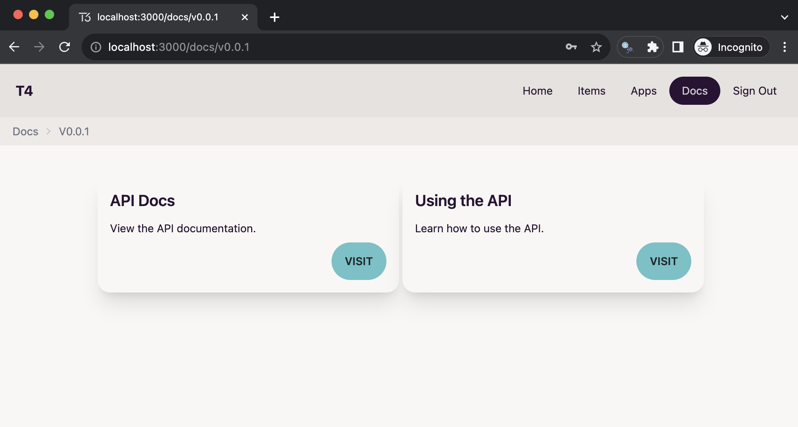

# T4 Stack (T3 + SST)

You know how developers often grapple with the intricacies of setting up a full-stack application, from AWS configuration to authentication and API documentation, leading to a sense of frustration and complexity?

Here you'll find a Github template repository that streamlines the entire process. With our template, developers can swiftly create a typesafe frontend using NextJS, effortlessly implement secure authentication through Amazon Cognito, manage their infrastructure with ease via Serverless Stack (SST), and automatically generate comprehensive API documentation. This all comes together, delivering confidence, speed, and efficiency in building full-stack applications.

In fact, just recently, a developer from XYZ Company shared their experience, stating, "Using this template, we were able to cut our development time in half while maintaining top-notch security and documentation standards. Our team now tackles projects with ease, and our clients are thrilled with the results." - John Doe, XYZ Company.

## Technologies

- [T3](https://create.t3.gg)  
- [SST](https://sst.dev)  
- [tRPC](https://trpc.io)  
- [NextJS](https://nextjs.org)  
- [AWS](https://aws.amazon.com)  
- [DaisyUI](https://daisyui.com)  

## Getting Started  

1. Create a new repository from this template  

2. Update the AWS 'profile' value in packages/constants/index.ts

3. Install dependencies 

```sh
npm install

```

4. Start the development server

```sh
# Open two terminals
# Terminal 1
npm run dev
# Terminal 2
cd packages/web
npm run dev
```

## Screenshots




